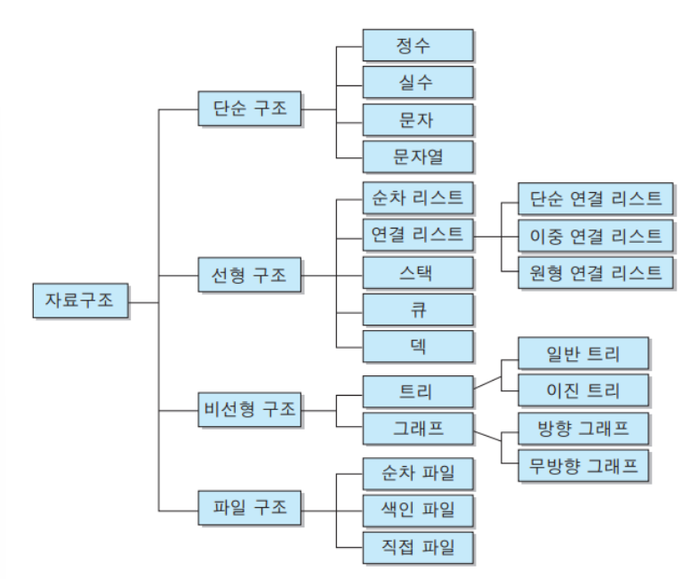

# **자료구조**란
사전적으로는 데이터(자료)의 집합이며,
각 원소들이 논리적으로 정의된 규칙에 의해 나열되며 자료에 대한 처리를 효율적으로 수행할 수 있도록 자료를 구분하여 표현한 것
  
## 자료구조의 선택 기준
자료의 처리를 보다 효율적으로 하기 위해 고려해야할 사항
- 자료의 처리 시간
- 자료의 크기
- 자료의 활용 빈도
- 자료의 갱신 정도
- 프로그램의 용이성

  
## 자료구조의 특징
1. **효율성**

    자료구조의 목적은 효율적인 데이터의 관리/사용이므로 적절한 자료구조를 선택한다면 효율성이 높아질 것이다.
    예를 들어, 데이터의 양이 많다면 순차 검색(Linear Search)보다는 이분 검색(Binary Search)을 활용하는 것이 더 효율적이다. 데이터가 N개가 있다고 할 때, 순차 검색으로는 최소 1번의 연산으로 찾을 수 있지만, 최대 N번의 연산을 거쳐야 한다. 그러나, 이분 검색은 대상을 절반씩 줄여가 최대 logN번만에 찾을 수 있다.

2. **추상화**

    추상화란 복잡한 자료, 모듈, 시스템 등으로부터 핵심적인 개념만 간추려 내는 것이다. 자료구조를 구현할 때 중요한 것은 어느 시점에 데이터를 삽입할 것이며 어느 시점에 이러한 데이터를 어떻게 사용할 것인지에 대해 초점을 맞출 수 있기 때문에 구현 외적인 부분에 더 시간을 쏟을 수 있다.

    따라서, 자료 구조의 내부 구현은 중요하지 않다. 어떻게 구현했는 지 보다 어떻게 사용해야 하는지를 알고 있어야 한다.

3. **재사용성**

    자료구조를 설정할 때 특정 프로그램에서만 동작하게 설계하는 것이 아닌 다양한 프로젝트에서 동작할 수 있도록 범용성 있게 설계한다.

 

## 자료구조의 분류

1. **단순 구조**

    프로그래밍에서 사용되는 기본 데이터 타입
- 정수, 실수, 문자, 문자열

2. **선형 구조**

    저장되는 자료의 전후관계가 1:1
- 배열(Array)
- [연결 리스트(LinkedList)](./LinkedList/LinkedList.md)
- [스택(Stack)](./Stack.md)
- [큐(Queue)](./Queue.md)

3. **비선형 구조**

    데이터 항목 사이의 관계가 1:n 혹은 n:m
- 트리(Tree)
- 그래프(Graph)

4. **파일 구조**

    서로 관련된 필드들로 구성된 레코드의 집합인 파일에 대한 자료구조
- 순차 파일
- 색인 파일
- 직접파일

 

## 공부할 자료구조 순서
- [스택](./Stack.md) & [큐](./Queue.md) / 힙
- 해시 / 그래프
- 정렬 / 이분탐색
- 그리디
- 완전탐색(Brute Force)
- BFS / DFS
- DP
- 시뮬레이션 % 문자열