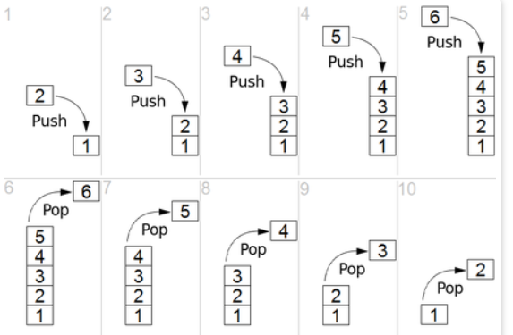

# 스택(Stack)

먼저 들어간 데이터가 나중에 나가는 구조이고, LIFO(Last In First Out) 형식의 자료구조이다

<br>


- 한쪽 끝에서만 자료를 넣고 뺄 수 있다

<br>

## 스택의 핵심적인 함수
- 데이터 삽입 : **push**
- 데이터 삭제 : **pop**

스택 자료구조를 사용할 때는 **오버플로우(Overflow)** 와 **언더플로우(Underflow)** 발생에 유의해야한다
- **오버 플로우** : 어떤 자료구조가 저장할 수 있는 데이터의 크기를 초과한 상태에서 데이터 삽입을 수행할 때 발생
- **언더 플로우** : 어떤 자료구조에 데이터가 전혀 없는 상태에서 데이터 삭제를 수행할 때 발생


<br>

## 스택의 동작 방식



- 시작하기 전 마지막 데이터가 스택의 어느 위치에 있는 지 기억하기 위해 ```top```이라는 변수를 생성한다.

    - 삽입 시 : ```top += 1```

1. **pop** : 스택 가장 위에 있는 데이터를 제거한다. 스택은 LIFO로 가장 최근에 추가한 데이터를 먼저 제거한다. 이때 top은  ```top = -1```

2. **push** : 데이터 하나를 스택의 가장 윗부분에 추가한다. 이때 top은 ```top += 1```

3. **peek** : 스택의 가장 위에 있는 데이터를 반환. 마지막 위치(top)에 해당하는 데이터를 읽어준다.
top의 변화 없음

4. **isEmpty** : 스택이 비어 있을 경우 true 반환


<br>

## 스택의 구현 방법
- 배열 기반 구현
- 연결리스트 기반 구현

1. **배열 기반 구현**
- **장점**

    구현이 쉽고 원하는 데이터의 접근 속도가 빠르다. 만약 내가 찾는 데이터가 배열의 5번째에 있다면 ```array[4]```를 사용해 한번에 접근이 가능하다. 

- **단점**

    데이터의 개수를 미리 지정해야해 push, pop을 사용할 때 비효율적이다. 만약 100개의 데이터가 있는데 첫번째 위치에 데이터를 삽입하려면 뒤에 있는 모든 데이터를 한칸씩(100번) 옮겨야 한다


2. **연결리스트 기반 구현**
- **장점**

    데이터의 최대 개수가 한정되어 있지 않고, 데이터의 삽입·삭제가 용이하다. 연결리스트 중간에 데이터를 삽입하고 싶으면 연결을 끊고 다음 위치에 해당하는 노드의 주소값만 바꾸어 주면 된다.

- **단점**

    배열과 다르게 한번에 원하는 데이터의 접근이 불가능하다. 연결되어 있는 링크를 따라 하나씩 확인하며 데이터를 찾아야 한다.


<br>

## 파이썬에서의 스택 구현
- **리스트 자료형** 사용
    
    : 가장 오른쪽에 원소를 삽입하는 ```append()``` 메소드와 가장 오른쪽에서 원소를 꺼내는 ```pop()``` 메소드를 지원한다.
    - ```append()```와 ```pop()```의 시간 복잡도는 O(1)이므로 스택 자료구조에 활용하기 적합하다


    ```python

    # 5 삽입 > 2 삽입 > 3 삽입 > 7 삽입 > 삭제 > 1 삽입 > 4 삽입 > 삭제 순으로 구현
    
    stack = []

    stack.append(5)
    stack.append(2)
    stack.append(3)
    stack.append(7)
    stack.pop()
    
    stack.append(1)
    stack.append(4)
    stack.pop()
    ```